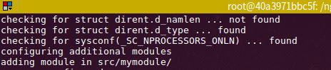
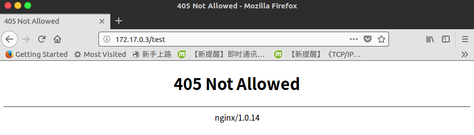
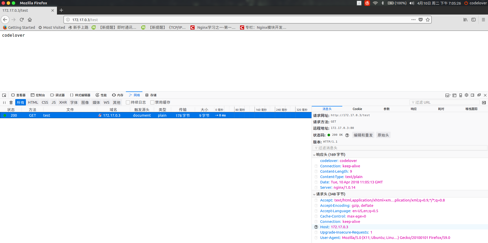
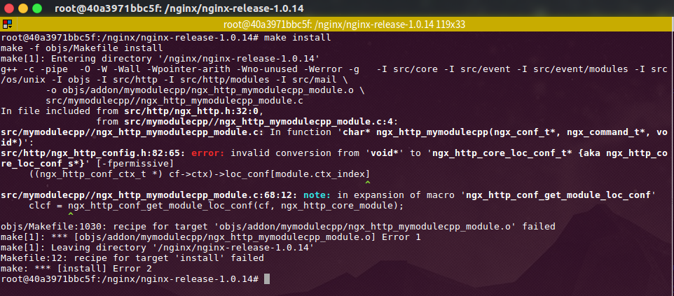
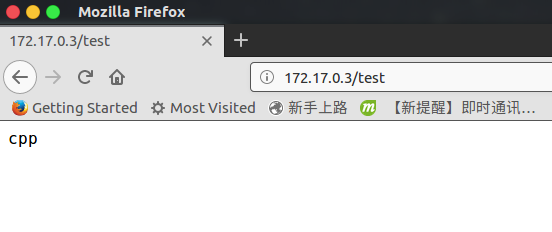

### 开发第一个Nginx模块

1. 首先在```/src```下建立文件夹```mymodule```
2. 配置```config文件```
    - config文件实际上是shell脚本
    - 开发一个HTTP模块需要包含如下变量
        
            #仅仅在configure使用，一般是模块名
            ngx_addon_name=ngx_mymodule
            
            #保存所有模块名的数组，不能直接赋值覆盖，因为还有其他模块在里面
            HTTP_MODULES="$HTTP_MODULES ngx_http_mymodule_module"
            
            #新增模块的源码文件
            NGX_ADDON_SRCS="$NGX_ADDON_SRCS $ngx_addon_dir/ngx_http_mymodule_module.c"
3. 在```/src/mymodule/```下创建源文件```ngx_http_mymodule_module.c```,必须和上面配置的一样
4. 测试下
    ```
        #执行configure使用--add-module=src/mymodule添加自己开发的模块
        ./configure --add-module=src/mymodule/ --without-http_rewrite_module --without-http_gzip_module
    ```
    
    
    可见已经添加了mymodule模块，由于还没有写代码，就不```make install```了
 5. 编写自己的模块（C语言版本）
    - 大致流程
        
         * 1,nginx读取到配置文件时，发现mymodule模块
         * 2,调用ngx_http_mymodule_commands指定的ngx_http_mymodule回调函数
         * 3,ngx_http_mymodule回调时设置处理HTTP的回调函数ngx_http_mymodule_handler
         
    - 首先引入需要的nginx核心模块
            
            #include <ngx_config.h>
            #include <ngx_core.h>
            #include <ngx_http.h>
            #include <ngx_string.h>
            #include <ngx_http_request.h>
            #include <ngx_hash.h>
    - 定义一个Nginx的HTTP模块 ngx_module_t，结构体说明如下：
            
            struct ngx_module_s {
                //表示当前模块在这类模块中的序号,对于所有http模块,
                //ctx_index是由核心模块ngx_http_module设置的
                //表达优先级和模块位置
                ngx_uint_t            ctx_index;
                //表示当前模块在所有模块中的序号
                ngx_uint_t            index;
                
                //保留字段,未使用
                ngx_uint_t            spare0;
                ngx_uint_t            spare1;
                ngx_uint_t            spare2;
                ngx_uint_t            spare3;
                //版本,目前只有1
                ngx_uint_t            version;
                //用于指向一类模块的上下文结构体,模块上下文。指向特定类型模块的公共接口
                void                 *ctx;
                //将处理nginx.conf中的配置项
                ngx_command_t        *commands;
                //模块类型,HTTP_FILTER_MODULES，CORE_MODULES，EVENT_MODULES，HTTP_MODULES，HTTP_HEADERS_FILER_MODULE
                //HTTP_FILTER_MODULES         --> http过滤模块
                //
                //CORE_MODULES                --> 核心模块
                //
                //EVENT_MODULES               --> 事件模块
                //
                //HTTP_MODULES                --> HTTP模块
                //
                //HTTP_HEADERS_FILER_MODULE   --> HTTP头部过滤模块
                //还可以自定义新的模块
                ngx_uint_t            type;
                
                /**
                * 七个重要的模块回调点
                */
                //master进程启动时调用，但是目前框架从不调用，因此直接设置成NULL就行
                ngx_int_t           (*init_master)(ngx_log_t *log);
                //初始化所有模块时被调用，master/worker模式下，在启动worker前完成
                ngx_int_t           (*init_module)(ngx_cycle_t *cycle);
                //worker子进程已经产生，每个worker进程初始化过程会调用所有模块的init_process
                ngx_int_t           (*init_process)(ngx_cycle_t *cycle);
                //由于nginx不支持多线程模式，所以init_thread在框架中没被调用过
                ngx_int_t           (*init_thread)(ngx_cycle_t *cycle);
                //此函数也没被调用
                void                (*exit_thread)(ngx_cycle_t *cycle);
                //worker进程退出前调用
                void                (*exit_process)(ngx_cycle_t *cycle);
                //master退出前被调用
                void                (*exit_master)(ngx_cycle_t *cycle);
                
                //尚未使用，用NGX_MODULE_V1_PADDING填充即可
                uintptr_t             spare_hook0;
                uintptr_t             spare_hook1;
                uintptr_t             spare_hook2;
                uintptr_t             spare_hook3;
                uintptr_t             spare_hook4;
                uintptr_t             spare_hook5;
                uintptr_t             spare_hook6;
                uintptr_t             spare_hook7;
            };
    - 代码如下：
            
            static ngx_int_t ngx_http_mymodule_handler(ngx_http_request_t *r);
            static char *
            ngx_http_mymodule(ngx_conf_t *cf, ngx_command_t *cmd, void *conf);
            static ngx_command_t ngx_http_mymodule_commands[] = {
                    {
                            ngx_string("mymodule"),
                            NGX_HTTP_MAIN_CONF|NGX_HTTP_SRV_CONF|NGX_HTTP_LOC_CONF|NGX_HTTP_LMT_CONF|NGX_CONF_NOARGS,
                            //set回调函数，
                            //char               *(*set)(ngx_conf_t *cf, ngx_command_t *cmd, void *conf);
                            //当某个配置快中出现mymodule时，就会回调此函数
                            ngx_http_mymodule,
                            NGX_HTTP_LOC_CONF_OFFSET,
                            0,
                            NULL
                    },
                    //空的ngx_command_t用于表示数组结束
                    //#define ngx_null_command  { ngx_null_string, 0, NULL, 0, 0, NULL }
                    ngx_null_command
            
            };
            static ngx_http_module_t ngx_http_mymodule_module_ctx = {
                    NULL,
                    NULL,
                    NULL,
                    NULL,
                    NULL,
                    NULL,
                    NULL,
                    NULL
            };
            
            ngx_module_t ngx_http_mymodule_module = {
                    NGX_MODULE_V1,
                    //ctx,对于HTTP模块来说，ctx必须是ngx_http_module_t接口
                    &ngx_http_mymodule_module_ctx,
                    //commands,
                    ngx_http_mymodule_commands,
                    //定义http模块时，必须设置成NGX_HTTP_MODULE
                    NGX_HTTP_MODULE,
                    NULL,
                    NULL,
                    NULL,
                    NULL,
                    NULL,
                    NULL,
                    NULL,
                    NGX_MODULE_V1_PADDING
            };
            
            //配置项对应的回调函数
            static char *
            ngx_http_mymodule(ngx_conf_t *cf, ngx_command_t *cmd, void *conf)
            {
                ngx_http_core_loc_conf_t *clcf;
            
                clcf = ngx_http_conf_get_module_loc_conf(cf, ngx_http_core_module);
            
                //在NGX_HTTP_CONTENT_PHASE阶段会调用此回调函数
                clcf->handler = ngx_http_mymodule_handler;
            
                return NGX_CONF_OK;
            }
            
            //实际完成处理的回调函数
            /*
             * r 是nginx已经处理完了的http请求头
             */
            static ngx_int_t ngx_http_mymodule_handler(ngx_http_request_t *r)
            {
                return NGX_HTTP_NOT_ALLOWED;
            }
    - 测试下
        ```
            ./configure --add-module=src/mymodule/ --without-http_rewrite_module --without-http_gzip_module
            make install
        ```
        配置nginx.conf
            
            location /test{
                mymodule;
             }
        由于直接返回了NGX_HTTP_NOT_ALLOWED（405状态码）
        
6. 实现对http请求的处理

            if (!(r->method & (NGX_HTTP_GET | NGX_HTTP_HEAD))) {
        //非法请求方式 状态码 405
                return NGX_HTTP_NOT_ALLOWED;
            }
        //丢弃客户端发送来的HTTP包体内容
            ngx_int_t rc = ngx_http_discard_request_body(r);
            if (rc != NGX_OK) {
                return rc;
            }
        
            ngx_str_t type = ngx_string("text/plain");
            ngx_str_t response = ngx_string("codelover");
            r->headers_out.status = NGX_HTTP_OK;
            r->headers_out.content_length_n = response.len;
            r->headers_out.content_type = type;
        //自定义响应头
            ngx_table_elt_t* p = ngx_list_push(&r->headers_out.headers);
            p->hash = 1;
            p->key.len = sizeof("codelover")-1;
            p->key.data = (u_char*)"codelover";
            p->value.len = sizeof("codelover")-1;
            p->value.data = (u_char*)"codelover";
        
        //发送响应头
            rc = ngx_http_send_header(r);
            if (rc == NGX_ERROR || rc > NGX_OK || r->header_only) {
                return rc;
            }
        
            ngx_buf_t *b;
        //r->pool内存池
            b = ngx_create_temp_buf(r->pool, response.len);
            if (b == NULL) {
                return NGX_HTTP_INTERNAL_SERVER_ERROR;
            }
        
            ngx_memcpy(b->pos, response.data, response.len);
        //必须设置好last指针，如果last和pos相等，是不会发送的
            b->last = b->pos + response.len;
        //声明这是最后一块缓冲区
            b->last_buf = 1;
        
            ngx_chain_t out;
            out.buf = b;
            out.next = NULL;
        
            return ngx_http_output_filter(r, &out);
            
    
    至此，一个简单的nginx模块就开发完成。
7. 修改成c++版本
    - 1,编译方式修改
    
        最好不要修改configure文件，所以修改Makefile文件：
            
            #新增g++编译器，前提是已经在系统安装g++
            CXX = g++
            #修改连接器为g++
            LINK = $(CXX)
            #修改自己的模块的编译方式为g++
            objs/addon/mymodulecpp/ngx_http_mymodulecpp_module.o:	$(ADDON_DEPS) \
            	src/mymodulecpp//ngx_http_mymodulecpp_module.cpp
            	$(CXX) -c $(CFLAGS)  $(ALL_INCS) \
            		-o objs/addon/mymodulecpp/ngx_http_mymodulecpp_module.o \
            		src/mymodulecpp//ngx_http_mymodulecpp_module.cpp
    - 2,源码修改
        把关于nginx的头文件使用extern "C" 括起来，保证编译时使用的是gcc，部分回调函数也要括起来
            
            extern "C"{
                #include <ngx_config.h>
                #include <ngx_core.h>
                #include <ngx_http.h>
                #include <ngx_string.h>
                #include <ngx_http_request.h>
                #include <ngx_hash.h>
                #include <ngx_http_config.h>
            static ngx_int_t ngx_http_mymodulecpp_handler(ngx_http_request_t *r);
            static char *
            ngx_http_mymodulecpp(ngx_conf_t *cf, ngx_command_t *cmd, void *conf);
            }
    - 3,可能的错误
        
        这是由于g++不支持将void* 和其他类型的指针进行隐式转换，因此需要修改
        ```clcf = (ngx_http_core_loc_conf_t *)ngx_http_conf_get_module_loc_conf(cf, ngx_http_core_module);```
        和```ngx_table_elt_t* p = (ngx_table_elt_t*)ngx_list_push(&r->headers_out.headers);```
        进行强制转换
    - 4,参考代码
        ```
        extern "C"{
            #include <ngx_config.h>
            #include <ngx_core.h>
            #include <ngx_http.h>
            #include <ngx_string.h>
            #include <ngx_http_request.h>
            #include <ngx_hash.h>
            #include <ngx_http_config.h>
        static ngx_int_t ngx_http_mymodulecpp_handler(ngx_http_request_t *r);
        static char *
        ngx_http_mymodulecpp(ngx_conf_t *cf, ngx_command_t *cmd, void *conf);
        }
        //只是包含了c++的库
        //#include <iostream>
        //#include <string>
        //using namespace std;
        #include "ngx_http_mymodulecpp_module.h"
        
        static ngx_command_t ngx_http_mymodulecpp_commands[] = {
                {
                        ngx_string("mymodulecpp"),
                        NGX_HTTP_MAIN_CONF|NGX_HTTP_SRV_CONF|NGX_HTTP_LOC_CONF|NGX_HTTP_LMT_CONF|NGX_CONF_NOARGS,
                        //set回调函数，
                        //char               *(*set)(ngx_conf_t *cf, ngx_command_t *cmd, void *conf);
                        //当某个配置快中出现mymodulecpp时，就会回调此函数
                        ngx_http_mymodulecpp,
                        NGX_HTTP_LOC_CONF_OFFSET,
                        0,
                        NULL
                },
                //空的ngx_command_t用于表示数组结束
                //#define ngx_null_command  { ngx_null_string, 0, NULL, 0, 0, NULL }
                ngx_null_command
        
        };
        static ngx_http_module_t ngx_http_mymodulecpp_module_ctx = {
                NULL,
                NULL,
                NULL,
                NULL,
                NULL,
                NULL,
                NULL,
                NULL
        };
        
        ngx_module_t ngx_http_mymodulecpp_module = {
                NGX_MODULE_V1,
                //ctx,对于HTTP模块来说，ctx必须是ngx_http_module_t接口
                &ngx_http_mymodulecpp_module_ctx,
                //commands,
                ngx_http_mymodulecpp_commands,
                //定义http模块时，必须设置成NGX_HTTP_MODULE
                NGX_HTTP_MODULE,
                NULL,
                NULL,
                NULL,
                NULL,
                NULL,
                NULL,
                NULL,
                NGX_MODULE_V1_PADDING
        };
        
        //配置项对应的回调函数
        static char *
        ngx_http_mymodulecpp(ngx_conf_t *cf, ngx_command_t *cmd, void *conf)
        {
            ngx_http_core_loc_conf_t *clcf;
        
            clcf = (ngx_http_core_loc_conf_t *)ngx_http_conf_get_module_loc_conf(cf, ngx_http_core_module);
        
            //在NGX_HTTP_CONTENT_PHASE阶段会调用此回调函数
            clcf->handler = ngx_http_mymodulecpp_handler;
        
            return NGX_CONF_OK;
        }
        //实际完成处理的回调函数
        /*
         * r 是nginx已经处理完了的http请求头
         */
        static ngx_int_t ngx_http_mymodulecpp_handler(ngx_http_request_t *r)
        {
        
            if (!(r->method & (NGX_HTTP_GET | NGX_HTTP_HEAD))) {
        //非法请求方式 状态码 405
                return NGX_HTTP_NOT_ALLOWED;
            }
        //丢弃客户端发送来的HTTP包体内容
            ngx_int_t rc = ngx_http_discard_request_body(r);
            if (rc != NGX_OK) {
                return rc;
            }
            //测试c++语法是否支持
            string* a = new string("cpp");
            ngx_str_t type = ngx_string("text/plain");
            ngx_str_t response = ngx_string(a->c_str());
            r->headers_out.status = NGX_HTTP_OK;
            r->headers_out.content_length_n = a->length();
            r->headers_out.content_type = type;
        //自定义响应头
            ngx_table_elt_t* p = (ngx_table_elt_t*)ngx_list_push(&r->headers_out.headers);
            p->hash = 1;
        
            p->key.len = sizeof("codelover")-1;
            p->key.data = (u_char*)"codelover";
            p->value.len = sizeof("codelover")-1;
            p->value.data = (u_char*)"codelover";
        
        //发送响应头
            rc = ngx_http_send_header(r);
            if (rc == NGX_ERROR || rc > NGX_OK || r->header_only) {
                return rc;
            }
        
            ngx_buf_t *b;
        //r->pool内存池
            b = ngx_create_temp_buf(r->pool, response.len);
            if (b == NULL) {
                return NGX_HTTP_INTERNAL_SERVER_ERROR;
            }
        
            ngx_memcpy(b->pos, response.data, response.len);
        //必须设置好last指针，如果last和pos相等，是不会发送的
            b->last = b->pos + response.len;
        //声明这是最后一块缓冲区
            b->last_buf = 1;
        
            ngx_chain_t out;
            out.buf = b;
            out.next = NULL;
        
            return ngx_http_output_filter(r, &out);
        }
        ```
    

    至此就完成了使用c++进行模块开发的例子